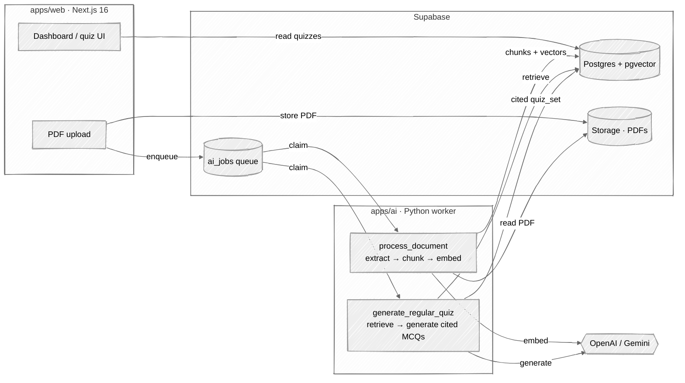
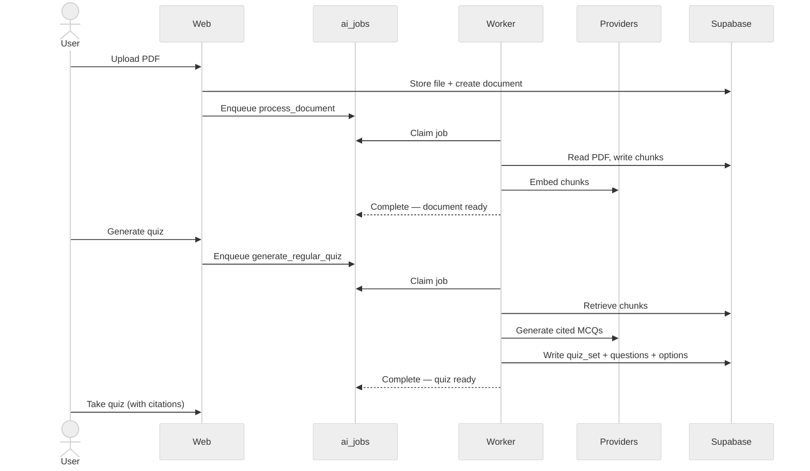

# AutoQuiz — Document-to-Quiz SaaS Platform

AutoQuiz turns PDFs into source-cited quizzes. Documents are extracted, chunked,
and embedded into a pgvector store; quiz questions are generated from the
retrieved chunks and cite the page and passage they came from. It is a monorepo:
a Next.js web app and a Python AI worker that share one Supabase project.

## Architecture



The web app enqueues background work by inserting rows into the `ai_jobs` table.
A separate Python worker claims and runs those jobs. **The worker, not the
FastAPI server, is what processes jobs** — see [Running locally](#running-locally).

### Job lifecycle



RAG pipeline: **upload → extract → embed → retrieve → generate → cited quiz**.

## Tech Stack

- **Web**: Next.js 16 (App Router) + React 19 + TypeScript, Tailwind CSS v4,
  HeroUI v3, next-themes, lucide-react, recharts, Tiptap.
- **AI worker**: Python (FastAPI for health, stdlib `urllib` for Supabase I/O),
  [Docling](https://github.com/DS4SD/docling) for PDF extraction, OpenAI and/or
  Google Gemini for embeddings and generation.
- **Data/Auth/Storage**: Supabase (Postgres + pgvector + Storage + Row Level
  Security), accessed with `@supabase/ssr`.
- **Payments**: Stripe (Checkout + webhooks).
- **Client-side PDF text**: `pdfjs-dist` (legacy quiz path).

## Prerequisites

- **Node.js 20.16+** (Next.js 16) — Node 22 LTS or newer recommended
- **Python 3.10+** (3.11 / 3.12 have the smoothest wheels for Docling's PyTorch
  dependency)
- A **Supabase** project
- At least one AI provider key — **OpenAI** (product default) and/or **Google
  Gemini** (the dev/fallback path this repo is tested against)
- **Stripe** account — only needed to exercise the credit/billing flow

## Getting Started

### 1. Clone and install web dependencies

```bash
git clone <your-repo-url>
cd autoquiz
npm install
```

### 2. Install AI worker dependencies

The worker lives in `apps/ai`. Docling pulls PyTorch, so this install is large
(multiple GB); give it a minute.

```bash
python3 -m venv .venv
source .venv/bin/activate
pip install -r apps/ai/requirements.txt
```

> Unit tests (`npm run ai:test`) import Docling lazily and need no provider keys,
> so they run even before the heavy install finishes.

### 3. Configure environment

There is **one** `.env` at the repo root — the single source of truth. `apps/web`
loads it via `apps/web/next.config.ts`; `apps/ai` reads it from the working
directory. Copy the template and fill in real values:

```bash
cp .env.example .env
```

```env
# ── Supabase (web) ──────────────────────────────────────────────
NEXT_PUBLIC_SUPABASE_URL=your_supabase_project_url
NEXT_PUBLIC_SUPABASE_ANON_KEY=your_supabase_anon_key
SUPABASE_SERVICE_ROLE_KEY=your_supabase_service_role_key

# ── Stripe (optional — billing only) ────────────────────────────
STRIPE_SECRET_KEY=sk_test_your_stripe_secret_key
STRIPE_WEBHOOK_SECRET=whsec_your_webhook_secret

# ── Legacy web Gemini quiz path ─────────────────────────────────
GEMINI_API_KEY=your_gemini_api_key
GEMINI_MODEL=gemini-1.5-pro

# ── App URL (optional) ──────────────────────────────────────────
NEXT_PUBLIC_APP_URL=http://localhost:3000

# ── AI worker (apps/ai) ─────────────────────────────────────────
# The worker reads AUTOQUIZ_AI_*-prefixed vars only.
AUTOQUIZ_AI_SUPABASE_URL=your_supabase_project_url
AUTOQUIZ_AI_SUPABASE_SERVICE_ROLE_KEY=your_supabase_service_role_key
AUTOQUIZ_AI_WORKER_ID=autoquiz-ai-local

# Providers. Defaults are OpenAI for both; switch to gemini for a key-light
# local run. Embeddings must use the SAME provider for indexing and retrieval
# (each provider has its own vector table / match RPC).
AUTOQUIZ_AI_EMBEDDING_PROVIDER=gemini
AUTOQUIZ_AI_GENERATION_PROVIDER=gemini
AUTOQUIZ_AI_GEMINI_API_KEY=your_gemini_api_key
# AUTOQUIZ_AI_OPENAI_API_KEY=your_openai_api_key   # if using openai providers
```

See the [full variable reference](#environment-variables-reference) below.

### 4. Apply the database schema

In the Supabase SQL Editor, paste and run the entire contents of
`supabase/schema.sql`. It creates:

- `profiles` (credit tracking) and the `add_credits` / `deduct_credit` RPCs
- The RAG data model: `documents`, `document_pages`, `document_chunks`,
  `chunk_embeddings_openai` / `chunk_embeddings_gemini`, `quiz_sets`,
  `questions`, `answer_options`, `rag_question_attempts`
- The `ai_jobs` queue plus its `claim_ai_job` / `update_ai_job_progress` /
  `complete_ai_job` / `fail_ai_job` RPCs
- The `vector` (pgvector) extension and `match_document_chunks_*` retrieval RPCs
- Legacy `quizzes` / `question_attempts` and `payment_events`
- The new-user profile trigger and Row Level Security policies

Then enable Auth providers under **Authentication → Providers** (Email and/or
Google OAuth). For Google, add the redirect URL
`http://localhost:3000/api/auth/callback`. Create a public **Storage** bucket for
uploaded PDFs if your project doesn't already have one.

## Running locally

Local testing of the full RAG flow needs **two processes**: the web app and the
AI worker.

### Web app

```bash
npm run dev
```

Open <http://localhost:3000> and sign in.

### AI worker

Jobs the web app enqueues (e.g. PDF processing) sit in `ai_jobs` until the worker
runs them. Each invocation claims and runs **one** queued job to completion:

```bash
npm run ai:run-once
```

To drain the queue continuously while you test, loop it:

```bash
while npm run ai:run-once; do sleep 2; done
```

Output is JSON: `{"status":"idle"}` when nothing is queued, or
`{"status":"claimed","job_id":...,"job_type":...}` after running one.

> The FastAPI server (`npm run ai:dev`, health at
> <http://localhost:8000/health>) is **only** a health endpoint — it does not
> process jobs. You don't need it for local RAG testing; run the worker instead.

### End-to-end smoke test

1. Sign in at <http://localhost:3000> (new users get 3 free credits).
2. Upload a PDF from the documents area — this enqueues a `process_document` job.
3. With the worker loop running, watch the document move to **ready** (extracted,
   chunked, embedded). Verify rows landed in `document_chunks` and the
   `chunk_embeddings_*` table for your provider.
4. Generate a quiz and take it.

> **Note:** the in-app "generate quiz" button still uses the legacy synchronous
> Gemini path (writes the `quizzes` table). The RAG generation handler
> (`generate_regular_quiz`) runs through the `ai_jobs` queue and the worker; the
> web UI that triggers it is being wired up (US-RAG-008b).

## Useful scripts

| Command | What it does |
| --- | --- |
| `npm run dev` | Web app on :3000 |
| `npm run build` / `npm start` | Production build / serve of the web app |
| `npm run lint` | Lint the web app |
| `npm run ai:run-once` | Claim and run one queued AI job |
| `npm run ai:dev` | FastAPI health server on :8000 |
| `npm run ai:health` | Print the health payload (no server) |
| `npm run ai:test` | Run the `apps/ai` unit suite |
| `npm run stripe:listen` | Forward Stripe webhooks to localhost |
| `npm run stripe:trigger` | Fire a test `checkout.session.completed` |

## Stripe Setup (optional)

Only needed to test the credit/billing flow.

1. Get your **Secret Key** from the Stripe Dashboard (Developers → API keys).
2. Forward webhooks locally and copy the printed `whsec_…` into
   `STRIPE_WEBHOOK_SECRET`:

   ```bash
   npm run stripe:listen
   ```

3. Trigger a test checkout and confirm 10 credits are applied:

   ```bash
   npm run stripe:trigger
   ```

   The webhook at `/api/webhooks/stripe` verifies the signature, checks the
   session hasn't been processed, and adds credits atomically with a service-role
   client.

> **Production:** create a real webhook endpoint pointing at
> `https://your-domain.com/api/webhooks/stripe`, subscribe to
> `checkout.session.completed`, and copy that secret into your production env.

## Environment Variables Reference

| Variable | Used by | Description | Required |
| --- | --- | --- | --- |
| `NEXT_PUBLIC_SUPABASE_URL` | web | Supabase project URL | Yes |
| `NEXT_PUBLIC_SUPABASE_ANON_KEY` | web | Supabase anon key | Yes |
| `SUPABASE_SERVICE_ROLE_KEY` | web | Service role key (webhooks) | Yes |
| `GEMINI_API_KEY` | web | Gemini key for the legacy quiz path | Yes |
| `GEMINI_MODEL` | web | Legacy Gemini model (default `gemini-1.5-pro`) | No |
| `STRIPE_SECRET_KEY` | web | Stripe secret key | For billing |
| `STRIPE_WEBHOOK_SECRET` | web | Stripe webhook signing secret | For billing |
| `NEXT_PUBLIC_APP_URL` | web | App URL for redirects | No |
| `AUTOQUIZ_AI_SUPABASE_URL` | worker | Supabase project URL | Yes |
| `AUTOQUIZ_AI_SUPABASE_SERVICE_ROLE_KEY` | worker | Service role key | Yes |
| `AUTOQUIZ_AI_WORKER_ID` | worker | Worker identity (default `autoquiz-ai-local`) | No |
| `AUTOQUIZ_AI_JOB_TYPES_CSV` | worker | Restrict claimable job types (default: all) | No |
| `AUTOQUIZ_AI_EMBEDDING_PROVIDER` | worker | `openai` (default) or `gemini` | No |
| `AUTOQUIZ_AI_GENERATION_PROVIDER` | worker | `openai` (default) or `gemini` | No |
| `AUTOQUIZ_AI_GENERATION_FALLBACK_PROVIDER` | worker | Fallback provider (default `gemini`) | No |
| `AUTOQUIZ_AI_OPENAI_API_KEY` | worker | OpenAI key (if using OpenAI providers) | Conditional |
| `AUTOQUIZ_AI_OPENAI_EMBEDDING_MODEL` | worker | Default `text-embedding-3-small` | No |
| `AUTOQUIZ_AI_OPENAI_CHAT_MODEL` | worker | Default `gpt-4o-mini` | No |
| `AUTOQUIZ_AI_GEMINI_API_KEY` | worker | Gemini key (if using Gemini providers) | Conditional |
| `AUTOQUIZ_AI_GEMINI_EMBEDDING_MODEL` | worker | Default `gemini-embedding-001` | No |
| `AUTOQUIZ_AI_GEMINI_CHAT_MODEL` | worker | Default `gemini-2.5-flash` | No |

At least one provider's key is required: supply `AUTOQUIZ_AI_OPENAI_API_KEY` when
the providers are `openai`, or `AUTOQUIZ_AI_GEMINI_API_KEY` when they are
`gemini`. Use the **same** embedding provider for indexing and retrieval — each
provider writes to its own `chunk_embeddings_*` table and matches via its own
RPC.

## Project Structure

```
apps/
├── web/                         # Next.js 16 app
│   ├── src/
│   │   ├── app/                 # Routes (dashboard, api, ...)
│   │   ├── actions/             # Server actions
│   │   ├── components/          # React components
│   │   ├── lib/                 # Supabase + provider clients
│   │   └── utils/               # Client-side PDF extraction
│   ├── public/
│   └── next.config.ts           # Loads the root .env
└── ai/                          # Python AI worker
    ├── app/
    │   ├── jobs/                # Queue: runner, repository, handlers
    │   │   ├── process_document.py    # extract → chunk → embed
    │   │   └── generate_quiz.py       # retrieve → generate cited MCQs
    │   ├── extraction.py        # Docling PDF extraction
    │   ├── embeddings.py        # OpenAI / Gemini embeddings
    │   ├── retrieval.py         # same-space chunk retrieval
    │   ├── llm.py               # provider abstraction + JSON validation
    │   ├── supabase_io.py       # PostgREST helpers (urllib)
    │   ├── config.py            # AUTOQUIZ_AI_* settings
    │   └── main.py              # FastAPI /health
    ├── run_once.py              # Claim and run one queued job
    └── requirements.txt
supabase/
└── schema.sql                   # Full schema: RAG data model, queue, RLS, RPCs
```

## Building for Production

```bash
npm run build
npm start
```

`vercel.json` builds the web app from the repo root and publishes
`apps/web/.next`. Deploy the Python worker (`apps/ai`) as a separate service that
runs `run_once.py` on a schedule or loop against the same Supabase project.

## License

MIT
